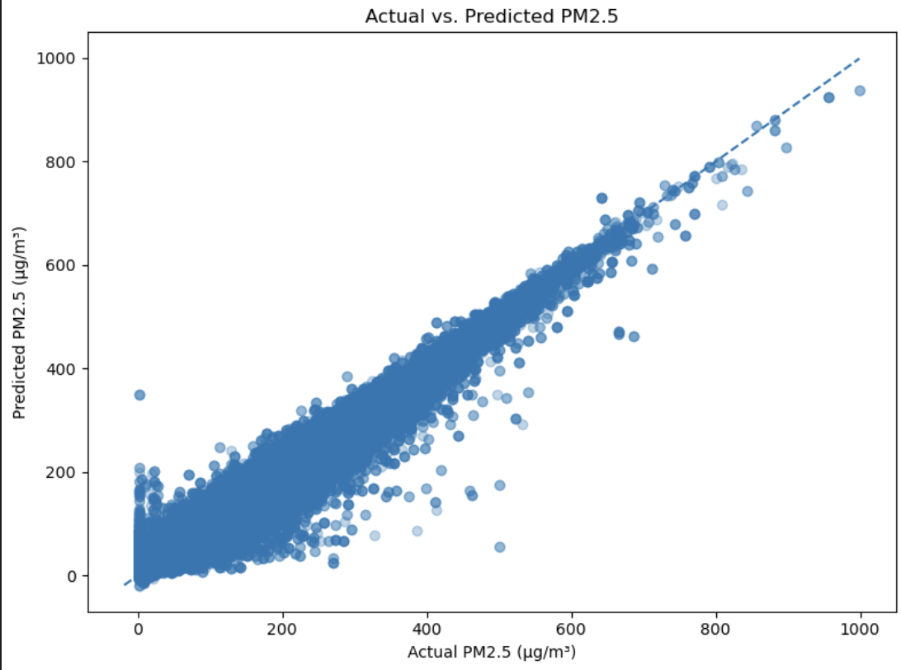
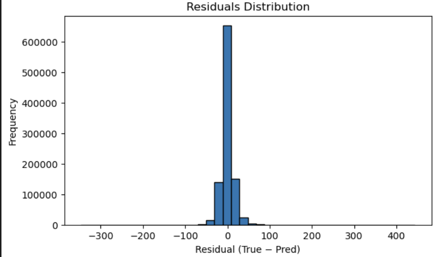

# Project Proposal

## Introduction/Background

Air pollution is a serious threat to humans worldwide. Exposure to air pollutants like particulate matter (PM2.5 and PM10) and harmful gases (NO₂, SO₂, CO) can lead to various health problems such as respiratory and cardiovascular issues [1]. Accurately predicting the Air Quality Index (AQI) is crucial to plan mitigation strategies and enable timely actions by health advisories.

Machine learning can be applied to account for complex, interrelated factors such as weather conditions, traffic patterns, and industrial emissions to predict the AQI [2]. This project aims to use ML models to predict daily AQI levels, at least for major cities, using publicly available datasets.

## Problem Definition

The main objective is to predict daily AQI values based on historical data. Short-term predictions can help health agencies better adapt to the adverse effects of pollution.

Traditional methods like statistical regression struggle to capture non-linear relationships and external factors such as wind speed and humidity. In contrast, techniques like Random Forest and deep learning can model these complexities, improving accuracy and providing valuable insights.

# Methods

### Data Collection

We sourced the **Beijing Multi-Site Air-Quality Data** from the **UCI Machine Learning Repository** [3]. This dataset includes hourly observations of six major pollutants:

- PM2.5
- PM10
- SO₂
- NO₂
- CO
- O₃

It also contains five weather features:

- Temperature
- Pressure
- Dew Point
- Wind Direction
- Wind Speed

The data spans five years.

### Data Cleaning and Preprocessing

- **Handling Missing Values:** We will use forward fill for gaps shorter than 6 hours and remove rows with longer gaps.
- **Aggregation:** Daily averages will be computed for pollutants and weather attributes. The AQI will be calculated following standard guidelines [4].
- **Normalization:** Features will be scaled between 0 and 1 to facilitate model training.

### ML Algorithms

1. **Random Forest Regression (Supervised Method):**  
   Combines multiple decision trees. It handles tabular data well and captures complex, non-linear relationships.

2. **Long Short-Term Memory (LSTM) Network (Supervised Method):**  
   A type of recurrent neural network (RNN) that excels at time-series data, capturing dependencies in AQI patterns.

3. **XGBoost:**  
   Utilizes gradient boosting to sequentially build decision trees, correcting errors at each step, leading to higher accuracy.

### Evaluation Metrics

- **Mean Absolute Error (MAE):** Average of absolute differences between predicted and actual values.
- **Root Mean Squared Error (RMSE):** Similar to MAE but penalizes larger errors more heavily.
- **R² (Coefficient of Determination):** Measures the proportion of variance explained by the model.

## Additional Steps We Can Take

- **Additional Inputs:** Incorporate satellite imagery or traffic data to improve accuracy.
- **Multi-day Forecasting:** Extend predictions to multiple days ahead.
- **Transfer Learning:** Apply the trained model to cities with similar pollution patterns to test generalization.

## Midterm Report
Fir midterm, we decided to go with  **Random Forest Regression** model to estimate AQI. We used **sklearn** library to import the model

---

### Preprocessing

- **Data Combining:**  
  WE combined all the csv files we got from the kaggle into one single file.
  we tried with single file and tested on other files, but the loss was high, so we combined the files so the model can better generalize the pattern and can make better predictions. 

- **Handling Missing Values:**  
  We found out that Random Forest cannot handle null inputs directly, we imputed missing values to ensure every feature had valid entries. We used forward and backward fill, in simple words it just uses the previous or the next value to fill missing values.
  
  

- **Feature Removal:**  
  Also after training the model, we saw that some features were redundant and did not impact the accuracy much, so we tested with removing those as well. But also removing too much resulted in lower perfomance as the dataset already had less features, and there were no strong correlation which we found out by making confusion matrix

- **Normalization:**  
  We normalized both the input features and the AQI labels as we found out it did better if we normalized the input and labels
  

---

### Model Training and Hyperparameter Tuning

- **Random Forest Regression:**  
  We splitted the data according to the year, into train and test data, as we found it made better predictions this way. We used random forest as our first model as it works well for non linear relationships. 

- **Randomized Search CV:**  
  To find the best hyperparamters (number of estimators, max depth, min samples split) we used Randomized Search Cross Validation. And through this we achieved **86%–89% accuracy** range (as measured by R²).
  Although we could not run it for long the Randomized Search due to limitations of our computers. So we lowered the number of iterations and Cross validations. 

- **Losses and Evaluation Metrics:**  
  We calculated the **Mean Absolute Error (MAE)** and the **Root Mean Squared Error (RMSE)** and **R²**. And used this to plot actual vs predicted values. This helped us see how good our model is.

---

### Visualizations

- **Feature Importance Plot:**  
  We generated a bar plot to see how important each feature is, and removing some features like station, No, WSPM, did not change the accuracy much.
  

- **Confusion Matrix:**  
  We generated confusion matrix to see how features coorelate to each other, and we found out they dont correlate that much. So we did not reduce the features, as we already had low features.

- **Prediction vs. Actual AQI Plot:**  
  We compared the predicted values against the true AQI values to visualize over- and under-prediction.
  

  

 

---

### Findings and Observations

1. **Overprediction at Low AQI Levels:**  
   One thing we observed was that the model **overpredicted** when the actual AQI values were particularly low. Reasons we came up were: 
   - **Data Imbalance:** There might be that the dataset had more high AQI values rather than low ones so it could not train well on that. 
   - **Uncaptured Variables:** Factors reducing pollution on certain days (e.g., reduced traffic, specific policies, or sudden weather changes) might not be fully captured by the features we used.  
   - **Normalization Effects:** While normalization generally helps, it can sometimes compress small differences in lower ranges of AQI, causing regression methods to overshoot.

2. **Correlation Among Features:**  
   Although we tested for correlation, we observed no strong feature relationships so hence we did not do any feature reduction strategy except for dropping redundant features.

3. **Model Accuracy:**  
   Achieving **86%–89%** accuracy indicates that the Random Forest approach was effective, but we will use XGboost and LSTM to see if they can perform better.

---

### Next Steps

- **Handling Low-AQI Instances More Nuancedly:**  
  We will consider techniques like **oversampling** or adjusting the **loss function** to penalize errors more heavily in lower ranges.

- **Additional Features and data**  
  We realized that our dataset does not have many features, so we will try to get dataset with more external features, and also try to get more data. 

- **Other Algorithms:**  
  Also we will be using other algorithms such as **LSTM** or **XGBoost** as they may have better overall performance.

# Final Report (LSTM and XG boost)
## LSTM (Long short term memory)

### 1. Data Exploration  
- **Dataset size using the same Beijing dataset that has:** ~9.6 million hourly records (2013–2017).  
- **observations:**  
  - Year/month/day/hour are uniformly represented (heatmap shows no missing time slots).  
  - Temperature, pressure, and dew point show clear seasonal patterns.  
- **Figures to include:**  
  - filled the missing values using forward/backward fill so there are no missing values before we train it on LSTM

  - Feature correlation matrix  
  This shows that gases are correlated to each other while the other features are not that highly correlated

---

### 2. Preprocessing & Feature Engineering  
1. **Missing values:** As mentioned before used forward/backward fill to fill in the missing values
2. **Temporal encodings:**  
   - `dow_sin`/`dow_cos` (day-of-week)  
   - `month_sin`/`month_cos`  
   - `hour_sin`/`hour_cos`  
3. **Log transforms:** Used log transofrmation to reduce the skew of PM2.5, PM10, CO, O3  
4. **Rolling statistics & lags:**  
   - 6- and 24-hour rolling mean/std of PM2.5  
   - PM2.5 lag features at 1, 3, 6, 12 hours  
5. **Normalization:** Used MinMax scaling on all features as normalization mostly makes the model work better  

---

### 3. Model Architecture  
- We used a sliding window of 48 consecutive hours (two days lookback). Each window was put in the two layer LSTM model. The first layer had 64 units, we also applied L2 regularization and 20% dropout rate to reduce overfitting. The output of this was fed to the second layer with 32 units with the same dropout and regularization. This condensed into a single feature vector. Finally, in the end we put a dense layer with one neuron and linear activation to get the prediction. We used Adam optimizer with learning rate of 0.003 and metrics we set were MAE and R². We also had early stopping, in case when validation loss did not improved for 10 epochs. 

---

### 4. Training & Validation  
- We split the data into 80% for training and the remaining 20% for testing. Training was done in batches of 64 windows. The result shows that there was rapid convergence in the start and after a few epochs, it was stable generalization. This showed that we prevent overfitting as well. 

---

### 5. Performance
- **MAE:** 0.0232  
- **RMSE:** 0.0357  
- **R²:** 0.8216  

---

### 6. Discussion & Insights  
- We were able to capture multi-day pollution cycles (high R²)
- Although our model underpredicts sharp AQI spikes, residual distribution shows slight skew at high levels. 
- **Feature insights:** PM2.5, NO₂, PM10 are most correlated with target; weather features add seasonal context.

---

### 7. Next Steps  
1. **Hyperparameter tuning:** grid search on layer sizes, learning rate, lookback length.  
2. **Model variants:** test Temporal Convolutional Networks or Attention-based RNNs.  
3. **External data:** integrate traffic counts, satellite aerosol optical depth.  
4. **Multi-step forecasting:** extend to 24- and 72-hour ahead predictions.

## XGBoost (Extreme Gradient Boosting)

### 1. Data Exploration  
- **Dataset**: Beijing Multi-Site Air Quality Data (2013–2017)  
- **Shape after cleaning**: Daily-aggregated dataset with pollutants + weather features  
- **Observations**:  
  - Time coverage is complete (no missing days after aggregation)  
  - PM2.5 and PM10 highly correlated  
  - Seasonal trends present in weather variables  

---

### 2. Preprocessing & Feature Engineering  
1. **Missing values**:  
   - Dropped rows with missing target `PM2.5`  
   - No other imputation necessary due to aggregation  
2. **Temporal features**:  
   - Created sin/cos encodings for hour and month cycles  
   - Added a 1-day lag of PM2.5 (`PM2.5_lag1`)  
3. **Categorical encoding**:  
   - One-hot encoded `wind direction` (`wd`) and `station`  
4. **Final feature list** included pollutants, weather, and time encodings (no dimensionality reduction)  

---

### 3. Model Training  
- Used `xgb.train()` with early stopping (stopped at optimal round to avoid overfitting)  
- Hyperparameters tuned with `RandomizedSearchCV` (20 trials, 3-fold CV)  
- Final model was refit using the best parameters and full training set  

---

### 4. Performance  
- **Final MAE**: 4.47 µg/m³  
- **Final RMSE**: 6.80 µg/m³  
- **Final R²**: 0.993  

---

### 5. Visualizations  
- **Predicted vs Actual PM2.5**  

- **Residuals distribution**

### 6. Discussion & Insights  
- XGBoost achieved near-perfect fit on the test set.  
- Strong correlation between predicted and actual PM2.5, with low variance in residuals.  
- Model underpredicts slightly at very high PM2.5 levels (as seen in scatter plot).  
- **Top features**: PM10, NO₂, TEMP — strong indicators of pollution dynamics.  
- XGBoost handles missing values and nonlinear interactions internally — no imputation logic needed.  

---

### 7. Next Steps  
1. Compare with LSTM & Random Forest under same preprocessing  
2. Ensemble XGBoost + LSTM for sequence + tabular modeling  
3. Deploy live pipeline for daily PM2.5 forecasting  
4. Incorporate spatial data (e.g., station locations, satellite data) to improve general

## References

[1] World Health Organization, “Ambient air pollution: Health impacts,” 2021. [Online]. Available: [https://www.who.int/health-topics/air-pollution](https://www.who.int/health-topics/air-pollution).

[2] Z. Zhang, C. Johansson, M. Engardt, M. Stafoggia, and X. Ma, "Improving 3-day deterministic air pollution forecasts using machine learning algorithms," Atmospheric Chemistry and Physics, vol. 24, pp. 807–851, 2024. Available: [https://doi.org/10.5194/acp-24-807-2024](https://doi.org/10.5194/acp-24-807-2024).

[3] S. Chen. "Beijing Multi-Site Air Quality," UCI Machine Learning Repository, 2017. [Online]. Available: [https://doi.org/10.24432/C5RK5G](https://doi.org/10.24432/C5RK5G).

[4] U.S. Environmental Protection Agency (EPA), “Technical assistance document for the reporting of daily air quality - the Air Quality Index (AQI),” *EPA-454/B-18-007*, 2018. Available: [https://document.airnow.gov/technical-assistance-document-for-the-reporting-of-daily-air-quailty.pdf](https://document.airnow.gov/technical-assistance-document-for-the-reporting-of-daily-air-quailty.pdf).

## Gantt Chart
Link: https://gtvault-my.sharepoint.com/:x:/g/personal/mzahid30_gatech_edu/EZVyCSOsiZxFi1-jNKBabAIBGMI3VCDF-aq4qKuwUIr0bA?e=GdJSHF

## Contribution Table

| Member Name | Contribution                      |
|-------------|-----------------------------------|
| Serhan      | Methods, Results, Presentation    |
| Hamza       | Methods and Presentation          |   
| Prama       | Methods, Results, Presentation    |
